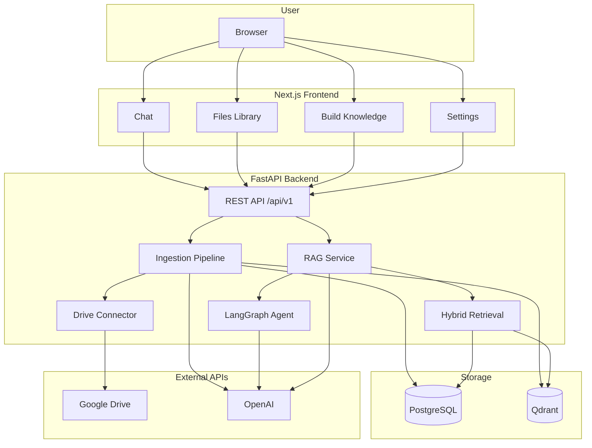
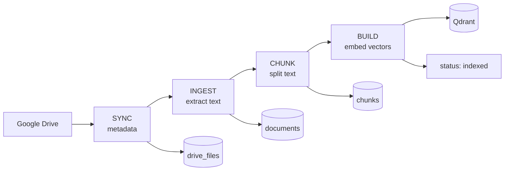
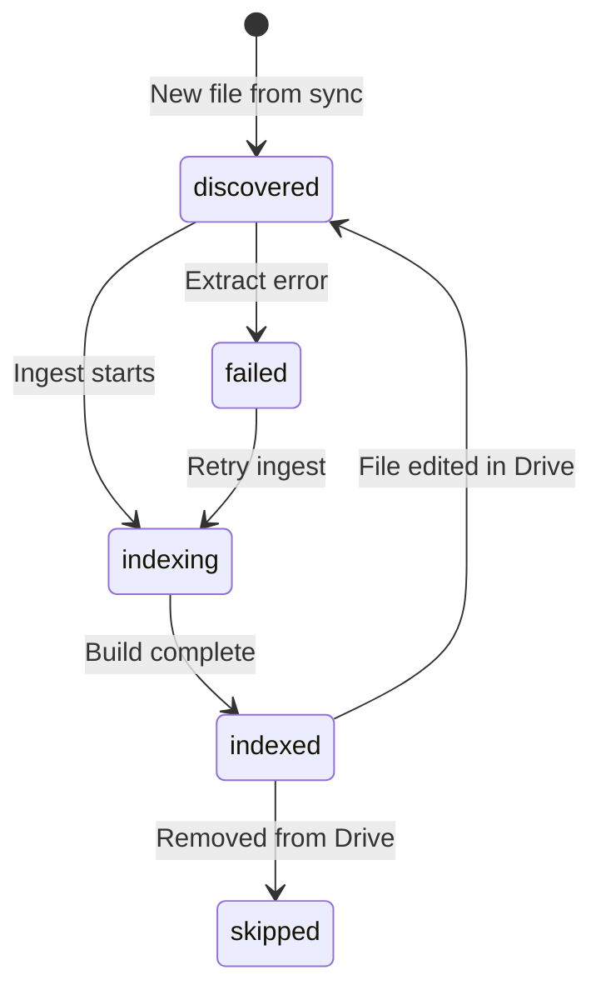
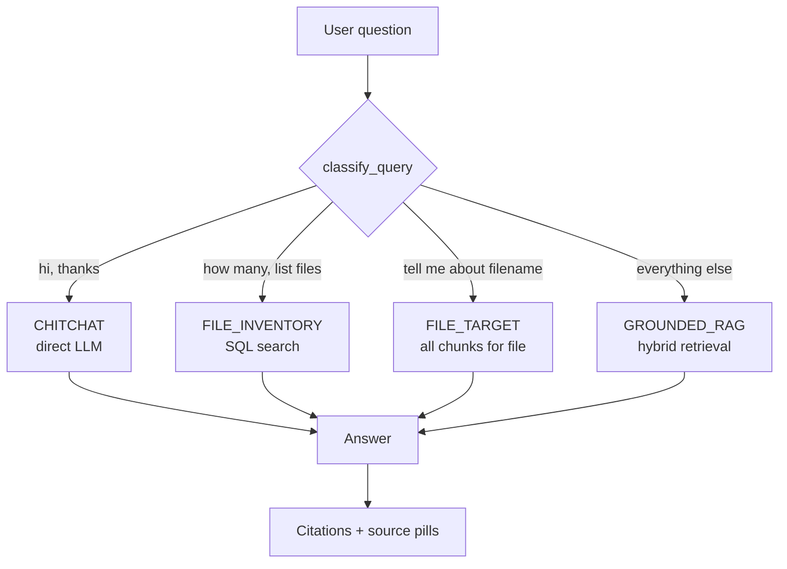
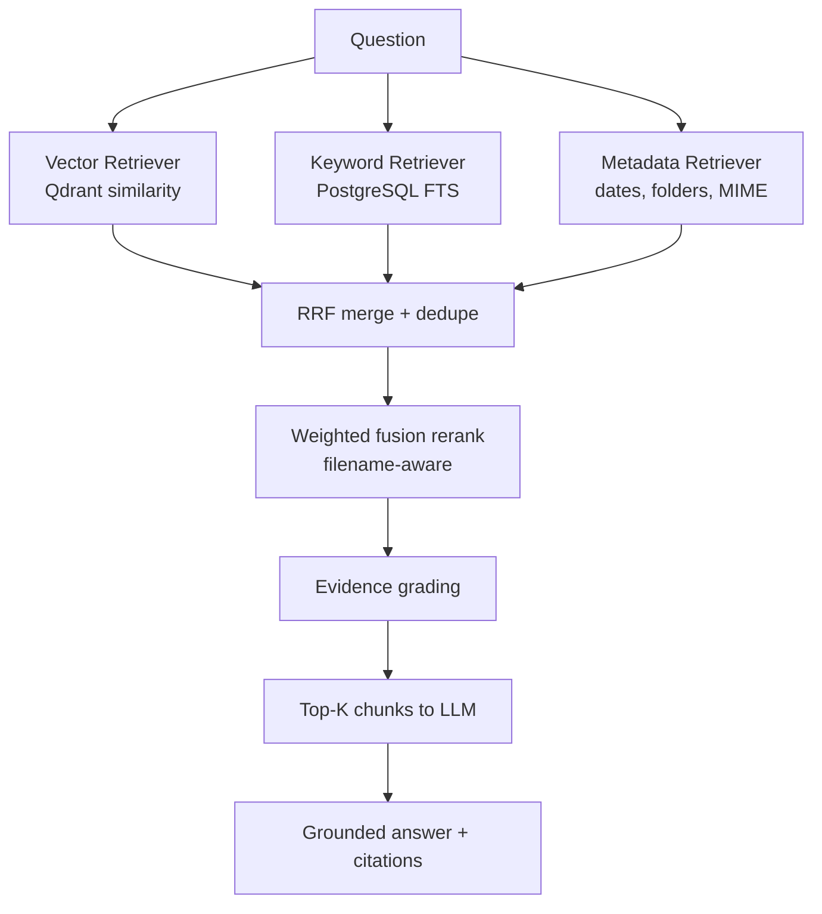
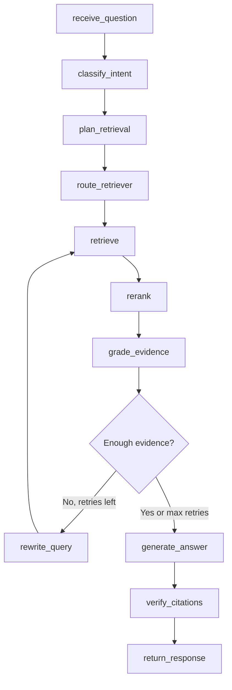
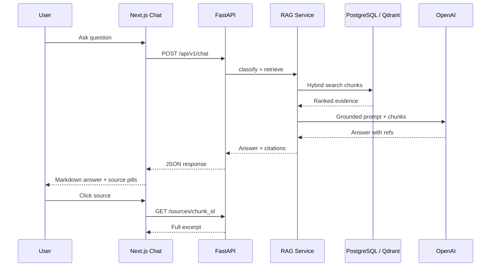

# DriveMind AI

**A LangGraph-powered personal knowledge assistant for Google Drive.**

DriveMind indexes your Google Drive, retrieves evidence with hybrid search (metadata + keyword + vector), and answers questions with citations. It is built as a production-style agentic RAG system — not a simple “chat with PDFs” demo.

Single-user MVP · read-only Drive access · grounded answers with sources

---

## What visitors should know

| Topic | Detail |
|-------|--------|
| **Purpose** | Portfolio-grade full-stack AI app demonstrating RAG, hybrid retrieval, and LangGraph orchestration |
| **Data source** | Your personal Google Drive (read-only) |
| **Answers** | Generated only from retrieved chunks — with clickable source citations |
| **Agent** | LangGraph workflow: intent routing → retrieval planning → rerank → evidence grading → rewrite loop → citation verify |
| **UI** | Next.js app: chat, file browser, indexing pipeline, settings, source viewer |
| **Status** | Phases 0–8 complete · Phase 9 complete · Phase 11 docs complete · Phase 10 planned |

---

## Features

### Retrieval & RAG
- Hybrid retrieval: metadata + PostgreSQL full-text keyword + Qdrant vector search
- Weighted fusion reranking with filename-aware boosting for named-file questions
- `FILE_TARGET` route for direct “tell me about *filename*” queries
- LangGraph agent behind `AGENT_GRAPH_ENABLED` (intent, rewrite, citation verify)
- Grounded chat API with citation snippets and source drill-down

### Indexing pipeline
- Incremental sync — only new or modified files are re-processed
- Supported types: Google Docs, PDF (text-only), TXT, DOCX, images (Tesseract OCR)
- Pipeline: **Sync → Ingest → Chunk → Build** (background jobs, pending-only optimization)
- Per-file prepare from the Files browser

### Frontend
- Chat with markdown answers, source pills, and citation side panel
- Chat history in sidebar (localStorage): new chat, rename, delete, search
- Message actions: copy, retry, regenerate, follow-up suggestions
- Keyboard shortcuts: `⌘K` / `Ctrl+K` focus composer · `⌘N` / `Ctrl+N` new chat
- Files library with search, status filters, and “Ask about this file”
- Setup wizard with full-scan retry for stale indexes
- Dark/light theme · responsive layout

---

## How it works

DriveMind has three main flows: **indexing** (Drive → searchable index), **query routing** (pick the right strategy), and **grounded answers** (retrieve evidence → cite sources).

### System overview



> The frontend only calls the backend API. It never talks to Drive, Qdrant, or OpenAI directly.

[Full architecture →](docs/ARCHITECTURE.md)

---

### 1. Indexing pipeline

Turns Google Drive files into searchable chunks and vectors. Runs as background jobs; only **pending** files are processed on repeat runs.



| Stage | API | Output |
|-------|-----|--------|
| Sync | `POST /index/sync` | File metadata in PostgreSQL |
| Ingest | `POST /index/ingest` | Extracted plain text (Docs, PDF, DOCX, TXT, OCR) |
| Chunk | `POST /index/chunk` | Text segments with file metadata |
| Build | `POST /index/build` | Embeddings in Qdrant; file marked **indexed** |



[Indexing guide →](docs/guides/INDEXING.md)

---

### 2. Query routing

Every question is classified before retrieval. This avoids using vector search for greetings, file counts, or named-file lookups.



[Retrieval guide →](docs/guides/RETRIEVAL.md)

---

### 3. Hybrid retrieval

For `GROUNDED_RAG` questions, three retrievers run in parallel. Results are merged, reranked, and graded before the LLM sees them.



---

### 4. LangGraph agent

When `AGENT_GRAPH_ENABLED=true`, the `GROUNDED_RAG` path uses a LangGraph workflow with intent planning, selective retrievers, and a rewrite loop when evidence is weak.



[LangGraph guide →](docs/guides/LANGGRAPH.md)

---

### 5. End-to-end chat flow



---

## Architecture (summary)

**Rule:** The frontend talks only to the FastAPI backend. It never calls Google Drive, Qdrant, or the LLM directly.

See [docs/ARCHITECTURE.md](docs/ARCHITECTURE.md) for layer responsibilities, data model, and deployment topology.

---

## Tech stack

| Layer | Technology |
|-------|------------|
| Backend API | FastAPI, Python 3.11+ |
| Agent | LangGraph + LangChain |
| Frontend | Next.js (App Router), TypeScript, Tailwind, shadcn/ui |
| Structured data | PostgreSQL + Alembic |
| Vector search | Qdrant |
| Embeddings / chat | OpenAI API |
| File source | Google Drive API (read-only OAuth) |
| OCR | Tesseract (`pytesseract`) |

---

## Prerequisites

- **Docker** — PostgreSQL and Qdrant via Compose
- **Python 3.11+** with [uv](https://github.com/astral-sh/uv)
- **Node.js 20+** and npm
- **Tesseract** — for image OCR (`brew install tesseract` on macOS)
- **Google Cloud OAuth** credentials (Drive read-only scope)
- **OpenAI API key**

---

## Quick start

### 1. Clone and configure

```bash
git clone <your-repo-url>
cd INFO_VAULT
cp .env.example .env
```

Edit `.env` and set at minimum:

| Variable | Purpose |
|----------|---------|
| `GOOGLE_CLIENT_ID` | OAuth client ID |
| `GOOGLE_CLIENT_SECRET` | OAuth client secret |
| `OPENAI_API_KEY` | Embeddings + chat |
| `FRONTEND_URL` | `http://localhost:3000` (OAuth redirect) |
| `AGENT_GRAPH_ENABLED` | `true` recommended for LangGraph path |

### 2. Start infrastructure

```bash
docker compose -f infra/docker-compose.yml up -d postgres qdrant
```

### 3. Backend

```bash
cd backend
uv sync --dev
uv run alembic upgrade head
uv run uvicorn app.main:app --reload --port 8000
```

### 4. Frontend (second terminal)

```bash
cd frontend
npm install
npm run dev
```

Open **http://localhost:3000**

### 5. First-time setup in the UI

1. **Settings** → Connect Google Drive
2. **Build knowledge** (or onboarding flow) → run setup (sync → ingest → chunk → embed)
3. **Chat** → ask a question; click sources to verify citations

---

## API overview

| Endpoint | Description |
|----------|-------------|
| `GET /api/v1/health` | Liveness |
| `GET /api/v1/health/ready` | DB readiness |
| `GET /api/v1/auth/google` | Start OAuth |
| `POST /api/v1/index/sync` | Sync Drive metadata |
| `POST /api/v1/index/ingest` | Extract text from pending files |
| `POST /api/v1/index/chunk` | Chunk pending documents |
| `POST /api/v1/index/build` | Embed + upsert to Qdrant |
| `GET /api/v1/index/pending` | Pending file counts per step |
| `GET /api/v1/files` | List indexed files |
| `POST /api/v1/chat` | Grounded Q&A with citations |
| `GET /api/v1/sources/{chunk_id}` | Full chunk for citation viewer |

---

## Development

```bash
# Backend tests (480+)
cd backend && uv run pytest -q

# Backend lint / types
uv run ruff check app tests
uv run mypy app

# Frontend tests
cd frontend && npm test

# Frontend build
npm run build
```

### Daily dev (two terminals)

```bash
# Terminal 1
cd backend && uv run uvicorn app.main:app --reload --port 8000

# Terminal 2
cd frontend && npm run dev
```

---

## Repository structure

```text
backend/app/
  api/           REST routes only
  agents/        LangGraph state, nodes, graph
  connectors/    Google Drive client and sync
  retrieval/     metadata, keyword, vector, hybrid, rerank
  services/      RAG, ingestion, indexing, chunking
  ingestion/     extractors and text pipeline
  embeddings/    embedding service + Qdrant
frontend/
  app/           Next.js pages (chat, files, index, settings)
  components/    UI by domain (chat, files, layout, knowledge)
  lib/           API client, hooks, conversations, knowledge
docs/            Context, roadmap, architecture, phase trackers
infra/           Docker Compose (Postgres + Qdrant)
```

---

## Project status

| Phase | Name | Status |
|-------|------|--------|
| 0–5 | Foundation → Embeddings | Complete |
| 6 | Basic RAG API | Complete |
| 7 | Hybrid Retrieval | Complete |
| 8 | LangGraph Agent | Complete |
| 9 | Frontend Foundation | Complete |
| 10 | Evaluation & Quality | Planned |
| 11 | Documentation & Deployment | Complete (docs) — see [PHASE_11_TRACKER.md](docs/PHASE_11_TRACKER.md) |

Resume point for contributors: [docs/CURRENT_STATUS.md](docs/CURRENT_STATUS.md)

---

## Documentation

| Doc | Description |
|-----|-------------|
| [Documentation Hub](docs/README.md) | Index of all guides and reference docs |
| [Portfolio Overview](docs/PORTFOLIO_OVERVIEW.md) | One-page summary for reviewers |
| [Local Setup](docs/guides/SETUP.md) | Prerequisites and first run |
| [Google OAuth](docs/guides/GOOGLE_OAUTH.md) | Drive connection setup |
| [Indexing Lifecycle](docs/guides/INDEXING.md) | Sync → ingest → chunk → build |
| [Retrieval Strategy](docs/guides/RETRIEVAL.md) | Hybrid search and query routing |
| [LangGraph Workflow](docs/guides/LANGGRAPH.md) | Agent orchestration |
| [Deployment](docs/guides/DEPLOYMENT.md) | Vercel + backend hosting |
| [PROJECT_CONTEXT.md](docs/PROJECT_CONTEXT.md) | Product vision, scope, principles |
| [ARCHITECTURE.md](docs/ARCHITECTURE.md) | System design and data flow |
| [CURRENT_STATUS.md](docs/CURRENT_STATUS.md) | Latest progress and commands |
| [Limitations & Future](docs/LIMITATIONS_AND_ROADMAP.md) | MVP scope and roadmap |

---

## Limitations (MVP)

- Single user, no multi-tenant auth UI
- Read-only Drive — no write/delete
- PDF text extraction only (no OCR for scanned PDFs yet)
- Chat history stored in browser `localStorage` (not server-backed)
- No SSE streaming for answers yet
- Audio / Whisper deferred

---

## License

Private portfolio project.
