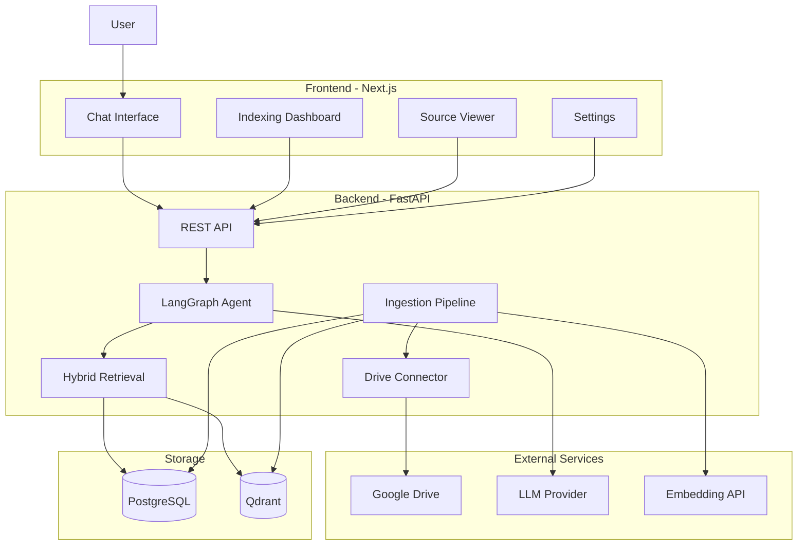
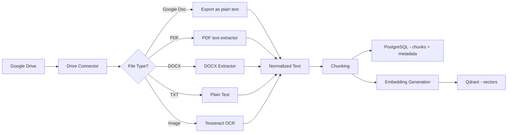
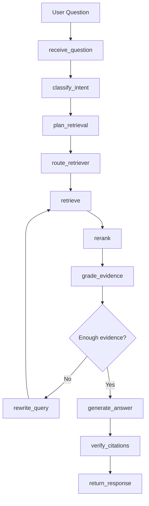
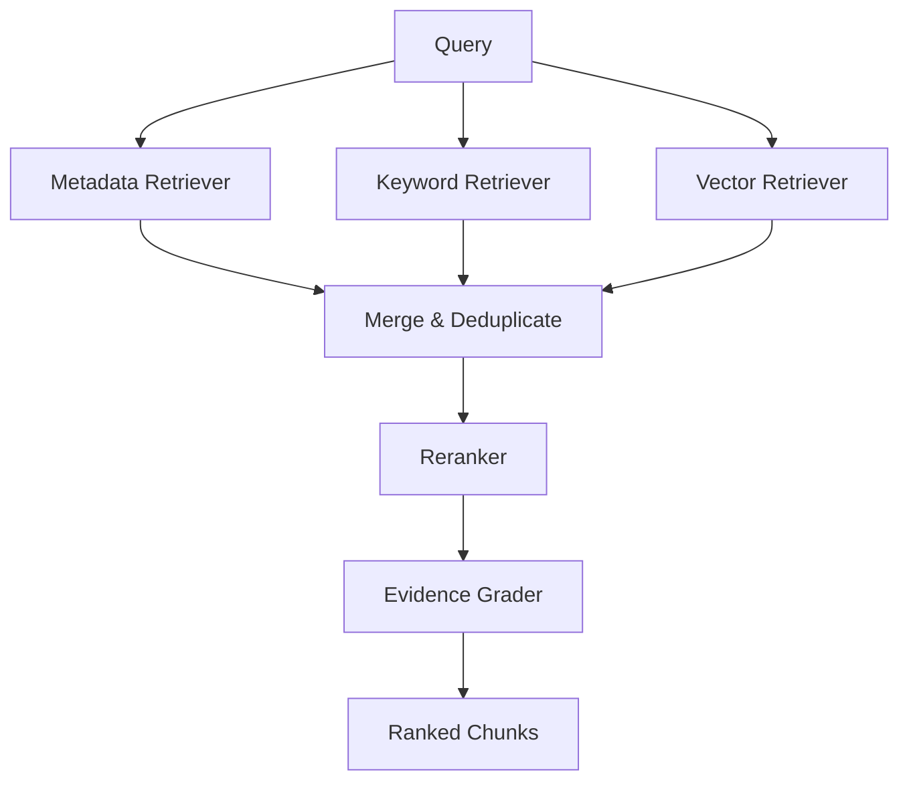
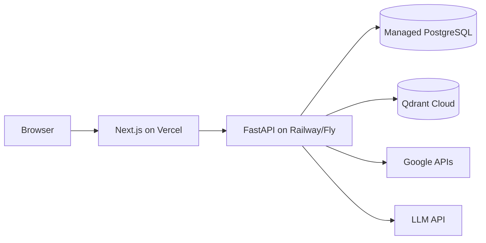

# DriveMind AI — Architecture

System design for the DriveMind AI personal knowledge assistant.

---

## System Context



---

## Layer Responsibilities

### Frontend (Next.js)

- Consumes backend REST API only
- **Does not** talk directly to Google Drive, Qdrant, or LLM
- Renders chat, indexing status, citations, and settings

### Backend API (FastAPI)

- Authentication and session management
- Google Drive OAuth callback handling
- Indexing trigger and status endpoints
- Chat endpoint (delegates to LangGraph agent)
- Source retrieval for citation viewer
- Evaluation endpoints

### LangGraph Agent

Orchestrates the full question-answering workflow. LangChain provides components; LangGraph controls flow.

### Ingestion Pipeline

Read-only sync from Google Drive → extract text → chunk → embed → store.

### Retrieval Layer

Hybrid search combining metadata, keyword, and vector strategies.

---

## Indexing Pipeline



### Supported File Types (MVP)

| Type | Extraction Method | Notes |
|------|-------------------|-------|
| Google Docs | Drive export API (`text/plain`) | Reuses Phase 3 content fetch |
| PDF | `pypdf` text extraction | Born-digital PDFs only; no OCR fallback in Phase 4 |
| DOCX | `python-docx` | Paragraph text; embedded images not OCR'd |
| TXT | Direct UTF-8 decode | |
| Images | Tesseract via `pytesseract` | Requires system `tesseract` install |

**Deferred (not Phase 4):** EasyOCR, PDF OCR for scanned/image-only PDFs.

---

## Query Pipeline (LangGraph)



### Intent Classification Examples

| Intent | Retrieval Strategy |
|--------|-------------------|
| Find latest file | Metadata (sort by modified date) |
| Keyword search | Keyword + vector |
| Summarize topic | Vector + keyword, multi-chunk |
| List duplicates | Metadata comparison |
| Semantic question | Vector primary |

---

## Retrieval Architecture



### Retriever Details

**Metadata Retriever** (`retrieval/metadata.py`)

- Filter by MIME type, folder path, modified date
- Sort by `modifiedTime` for "latest" queries
- Folder hierarchy from Drive parent IDs

**Keyword Retriever** (`retrieval/keyword.py`)

- PostgreSQL full-text search on chunk text
- Filename and tag matching
- Exact phrase support for names like "CoreChain", "PTCL"

**Vector Retriever** (`retrieval/vector.py`)

- Qdrant similarity search
- Filtered by user/file metadata in payload
- Top-k with score threshold

**Hybrid Merger** (`retrieval/hybrid.py`)

- Reciprocal rank fusion or weighted scoring
- Deduplicate by chunk ID
- Cap total chunks sent to LLM

---

## Storage Schema (Conceptual)

### PostgreSQL

```
users
  id, email, google_id, created_at

drive_files
  id, user_id, drive_file_id, name, mime_type,
  folder_path, modified_at, indexed_at, status

documents
  id, drive_file_id, extracted_text, extracted_text_hash, page_count

chunks
  id, document_id, chunk_index, text, metadata_json

indexing_jobs
  id, user_id, status, started_at, completed_at, error

query_history
  id, user_id, question, answer, citations_json, created_at
```

Phase 2 implementation status:

- Tables above are implemented via SQLAlchemy models in `backend/app/db/models/`
- Initial migration exists at `backend/alembic/versions/20260707_1409_initial_phase2_schema.py`

### Qdrant

```
Collection: drivemind_chunks
  vector: float[embedding_dim]
  payload:
    chunk_id (FK to PostgreSQL)
    drive_file_id
    filename
    mime_type
    modified_at
    chunk_index
```

**Rule:** Original file content lives in Google Drive. Chunk text lives in PostgreSQL. Embeddings live in Qdrant.

---

## API Surface (Planned)

| Method | Endpoint | Purpose |
|--------|----------|---------|
| GET | `/health` | Health check |
| GET | `/auth/google` | Start OAuth flow |
| GET | `/auth/google/callback` | OAuth callback |
| POST | `/index/sync` | Trigger Drive sync |
| GET | `/index/status` | Indexing job status |
| GET | `/files` | List indexed files |
| POST | `/chat` | Ask a question |
| GET | `/sources/{chunk_id}` | View source chunk |
| POST | `/eval/retrieval` | Run retrieval evaluation |

---

## Security Model (MVP)

- Single user, OAuth-based Google identity
- Read-only Drive scope: `drive.readonly`
- API keys and secrets in environment variables only
- No secrets in repository
- No original Drive files stored in repo or committed to Git

---

## Deployment Topology (Future)



Local development uses Docker Compose for PostgreSQL and Qdrant.

---

## Key Design Decisions

| Decision | Rationale |
|----------|-----------|
| LangGraph over linear chain | Agentic routing, query rewrite, evidence grading |
| Hybrid retrieval | Vector alone fails on "latest resume" and exact keyword queries |
| Chunk text in PostgreSQL | Source viewer, keyword search, auditability |
| Embeddings in Qdrant | Purpose-built vector search, decoupled from relational data |
| Backend-first development | Frontend depends on real APIs; avoids mock-driven UI |
| Read-only Drive | Safety for MVP; no risk of accidental file modification |
| Monorepo | Single repo for portfolio clarity; shared docs and infra |

---

## Non-Goals (MVP)

- Multi-tenant SaaS
- Write access to Google Drive
- Real-time collaborative editing
- Audio transcription (deferred)
- Autonomous file management actions
