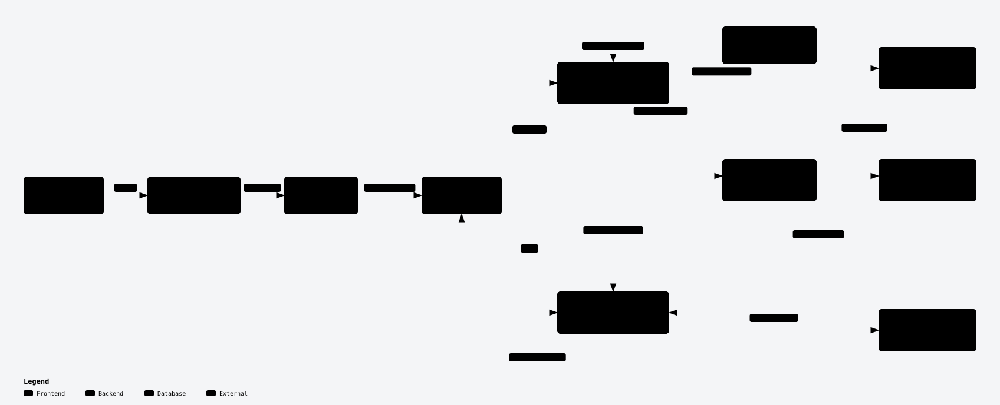

# DriveMind architecture

DriveMind is a single-user application that prepares read-only Google Drive content for local search and answers questions from that prepared index.

[View interactive architecture →](https://mahad816.github.io/DriveMind_AI/interactive/runtime/)

## Runtime components

| Component | Responsibility |
|-----------|----------------|
| Browser and Next.js | Chat, file browser, settings, and preparation UI. Conversation history is stored in browser localStorage. |
| Next.js `/api/v1` rewrite | Forwards same-origin API requests to FastAPI using `BACKEND_URL`. |
| FastAPI | REST routes, Drive authorization callbacks, in-process preparation jobs, RAG orchestration, and citation source lookup. |
| Google Drive | Read-only metadata and content source for sync and ingestion. Normal chat does not fetch Drive content. |
| PostgreSQL | Authoritative records for users/OAuth tokens, sync cursors, Drive metadata and statuses, extracted document text, chunks and full-text vectors, jobs, query history and citations. |
| Qdrant | Vector-search representations of indexed chunks, associated with PostgreSQL chunk UUIDs. It is not the primary text/document store. |
| OpenAI | Embeddings for index build and chat completions for generated answers. |

The frontend calls the FastAPI API through the Next.js rewrite. The backend owns all access to Drive, PostgreSQL, Qdrant, and OpenAI. Local development runs PostgreSQL and Qdrant through `infra/docker-compose.yml`; the diagram does not assume a particular hosted deployment.

## Knowledge preparation

The frontend starts and polls four separate FastAPI jobs: **sync → ingest → chunk → build**. Sync discovers or changes metadata and Drive cursor state; ingest later downloads or exports file content and extracts text; chunk writes searchable PostgreSQL chunk rows; build embeds eligible chunks with OpenAI, reconciles Qdrant points for each file, and marks the file indexed. These jobs execute within the FastAPI process.

Full sync takes a Changes API start page token before listing supported files, reconciles missing files after the scan, and persists the token with successful work. Incremental sync consumes a stored token and paginated changes, including removals, trashed files, and newly unsupported MIME types. A failed sync does not advance the successful cursor.

See the [Indexing guide](guides/INDEXING.md) for states and the detailed [sync and indexing diagram](guides/INDEXING.md#drive-sync-and-indexing).

## Question answering

`POST /chat` calls `RagService.ask`. A top-level router selects conversation-history recall, chitchat, file inventory, named-file lookup, or general grounded RAG. Chitchat and inventory do not return document citations. Named-file questions use direct PostgreSQL chunk retrieval. General grounded questions use the linear path by default: Qdrant vector retrieval, plus PostgreSQL keyword and metadata candidates when `HYBRID_RETRIEVAL_ENABLED=true`. `AGENT_GRAPH_ENABLED=true` enables a separate LangGraph retrieval/rewrite path for general grounded questions only.

Grounded evidence is selected within a context budget before OpenAI generation. Citation normalization ties returned references to selected prompt chunks. Query and answer records are persisted in PostgreSQL; `/sources/{chunk_id}` resolves a citation to indexed PostgreSQL text. Chat does not retrieve original content from Google Drive.

See the [Retrieval guide](guides/RETRIEVAL.md) for the [answer-flow diagram](guides/RETRIEVAL.md#question-to-answer) and the [LangGraph guide](guides/LANGGRAPH.md) for graph-specific nodes.

## Supported content

| Type | Extraction |
|------|------------|
| Google Docs | Drive export to plain text |
| TXT | Text decode |
| PDF | Text extraction; scanned PDFs have no OCR fallback |
| DOCX | Paragraph extraction |
| Images | Tesseract OCR |

Drive retains the original files. PostgreSQL retains extracted text and chunks; Qdrant retains vector-search representations.

## API surface

FastAPI mounts the following under `/api/v1`:

| Endpoint | Purpose |
|----------|---------|
| `GET /health`, `GET /health/ready` | Liveness and readiness |
| `GET /auth/google`, `GET /auth/google/callback` | Drive OAuth authorization |
| `POST /index/sync`, `/index/ingest`, `/index/chunk`, `/index/build` | Separate preparation jobs |
| `GET /index/status`, `GET /index/pending` | Job and pending-work status |
| `GET /files` | Synced metadata across statuses |
| `POST /chat` | Routed answer generation |
| `GET /sources/{chunk_id}` | Indexed chunk text for source viewer |

Evaluation tooling runs from the backend CLI; see the [Evaluation guide](guides/EVALUATION.md).

## Security and scope

Google OAuth authorizes read-only Drive access. It is not a separate application authentication or session protection boundary. This MVP uses single-user assumptions, including selecting the first stored OAuth token when no user ID is supplied; it does not provide multi-user isolation. Provider credentials belong in environment variables, never repository files. The backend reads Drive during sync/ingestion and uses the local index for normal answers.

For setup and deployment considerations, see [Local Setup](guides/SETUP.md) and [Deployment](guides/DEPLOYMENT.md).
