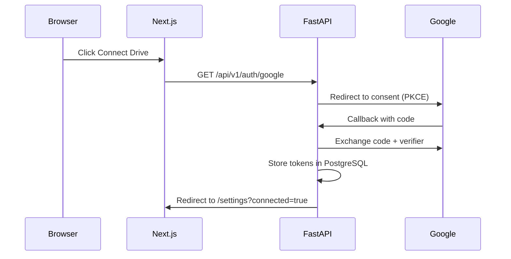

# Google Drive OAuth Setup

DriveMind uses **read-only** Google Drive OAuth 2.0 with PKCE. The backend stores refresh tokens in PostgreSQL; the frontend never sees Drive credentials.

---

## Scope

```
https://www.googleapis.com/auth/drive.readonly
```

DriveMind **never** writes, deletes, or modifies Drive files.

---

## Google Cloud Console steps

### 1. Create a project

1. Go to [Google Cloud Console](https://console.cloud.google.com/)
2. Create a new project (e.g. `DriveMind AI`)

### 2. Enable the Drive API

1. **APIs & Services → Library**
2. Search **Google Drive API**
3. Click **Enable**

### 3. Configure OAuth consent screen

1. **APIs & Services → OAuth consent screen**
2. Choose **External** (for personal/testing) or **Internal** (Workspace)
3. Fill app name, support email, developer contact
4. Add scope: `.../auth/drive.readonly`
5. Add your Google account as a **test user** (if External + Testing)

### 4. Create OAuth credentials

1. **APIs & Services → Credentials → Create Credentials → OAuth client ID**
2. Application type: **Web application**
3. Name: `DriveMind Local` (or production name)

**Authorized redirect URIs:**

| Environment | URI |
|-------------|-----|
| Local backend | `http://localhost:8000/api/v1/auth/google/callback` |
| Production backend | `https://<your-api-host>/api/v1/auth/google/callback` |

4. Copy **Client ID** and **Client secret** into `.env`:

```bash
GOOGLE_CLIENT_ID=....apps.googleusercontent.com
GOOGLE_CLIENT_SECRET=GOCSPX-...
GOOGLE_REDIRECT_URI=http://localhost:8000/api/v1/auth/google/callback
```

---

## OAuth flow in DriveMind



### Endpoints

| Method | Path | Behavior |
|--------|------|----------|
| `GET` | `/api/v1/auth/google` | 307 redirect to Google consent URL |
| `GET` | `/api/v1/auth/google/callback` | Exchange code, store tokens, redirect to frontend |

### PKCE

The backend generates `state` and `code_verifier`, stores them in `OAuthPendingState`, and validates on callback. This protects against authorization code interception.

### Post-login redirect

On success (HTML clients):

```
{FRONTEND_URL}/settings?connected=true&email=user@example.com
```

On error:

```
{FRONTEND_URL}/settings?error=...
```

JSON clients can send `Accept: application/json` to receive a JSON body instead of redirect.

---

## Environment variables

| Variable | Required | Example |
|----------|----------|---------|
| `GOOGLE_CLIENT_ID` | Yes | `123...apps.googleusercontent.com` |
| `GOOGLE_CLIENT_SECRET` | Yes | `GOCSPX-...` |
| `GOOGLE_REDIRECT_URI` | Yes | Must match Google Console exactly |
| `GOOGLE_DRIVE_SCOPES` | No | Default: `drive.readonly` |
| `FRONTEND_URL` | Yes | `http://localhost:3000` |

Restart the backend after changing OAuth env vars.

---

## Production checklist

- [ ] Add production redirect URI in Google Console
- [ ] Set `GOOGLE_REDIRECT_URI` to production backend callback
- [ ] Set `FRONTEND_URL` to production frontend (e.g. Vercel URL)
- [ ] Move OAuth app from **Testing** to **Published** (or keep test users)
- [ ] Never commit `.env`, client secret, or token files
- [ ] Use platform secret managers (Vercel env, Railway secrets, etc.)

---

## Revoking access

Users can revoke DriveMind in [Google Account → Third-party access](https://myaccount.google.com/permissions).

The Settings page disconnect action opens Google permissions for manual revocation.

---

## Troubleshooting

| Error | Cause | Fix |
|-------|-------|-----|
| `redirect_uri_mismatch` | URI doesn't match Console | Copy exact callback URL |
| `access_denied` | User declined or not a test user | Add account to test users |
| `503` on `/auth/google` | Missing client ID/secret | Fill `.env`, restart backend |
| Connected but sync fails | Token not persisted | Check Postgres; re-run OAuth |

---

## Related docs

- [Local Setup](SETUP.md)
- [Deployment](DEPLOYMENT.md) — production OAuth URLs
- [Architecture](../ARCHITECTURE.md) — auth layer design
