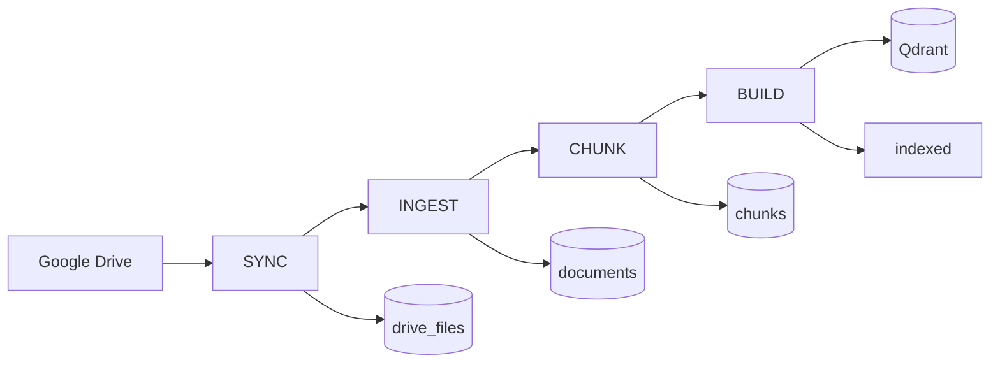
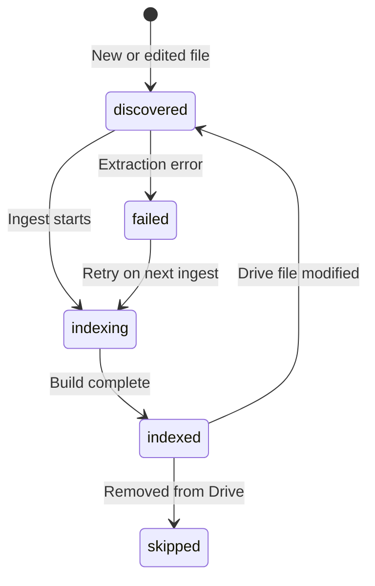

# Indexing Lifecycle

How DriveMind moves files from Google Drive into a searchable knowledge index.

---

## Pipeline overview



> Ingest writes to PostgreSQL only. **Build** (`IndexingService`) embeds chunks and upserts Qdrant.



Each stage is triggered by a `POST` endpoint and runs as a **background job**. Poll `GET /index/status` or `GET /index/pending` for progress.

---

## API endpoints

| Stage | Endpoint | Optional params |
|-------|----------|-----------------|
| Sync | `POST /api/v1/index/sync` | `full=true` for full rescan |
| Ingest | `POST /api/v1/index/ingest` | `file_id=<uuid>` for single file |
| Chunk | `POST /api/v1/index/chunk` | `file_id=<uuid>` |
| Build | `POST /api/v1/index/build` | `file_id=<uuid>` |
| Status | `GET /api/v1/index/status` | Latest job + connection flag |
| Pending | `GET /api/v1/index/pending` | Counts per stage |

All `POST` routes return **202 Accepted** immediately:

```json
{ "status": "started", "message": "Job started — poll /index/status for progress" }
```

---

## Stage 1: Sync (metadata)

**Service:** `DriveSyncService.sync_metadata`

Discovers files in Google Drive and upserts metadata into `drive_files`:

- `drive_file_id`, `name`, `mime_type`, `folder_path`, `modified_at`
- Initial file status: `DISCOVERED`

### Full vs incremental

| Mode | When | Behavior |
|------|------|----------|
| **Incremental** (default) | `full=false`, sync state exists | Drive Changes API from stored page token |
| **Full** | `full=true` or first sync | Lists all supported files + folder paths |

### Change handling

| Drive event | DriveMind action |
|-------------|------------------|
| New file | Insert as `DISCOVERED` |
| Modified file (was `INDEXED`) | Reset to `DISCOVERED` for re-pipeline |
| Removed file | Mark `SKIPPED` |
| Unchanged metadata | No DB update |

---

## Stage 2: Ingest (text extraction)

**Service:** `IngestionService.ingest_files`

Downloads file content from Drive and extracts plain text into `documents.extracted_text`.

### Supported file types

| Type | Method |
|------|--------|
| Google Docs | Drive export as `text/plain` |
| PDF | `pypdf` text extraction (born-digital only) |
| TXT | UTF-8 decode |
| DOCX | `python-docx` |
| Images | Tesseract OCR via `pytesseract` |

### Which files are processed

Only files with status `DISCOVERED`, `INDEXING`, or `FAILED` (plus optional `file_id` filter).

### Incremental skip

Ingest skips work when:

1. Latest `Document.updated_at >= drive_file.modified_at` — no download needed
2. `extracted_text_hash` unchanged after download — content unchanged

Outcomes per file: `ingested`, `unchanged`, `failed`, `skipped`.

---

## Stage 3: Chunk

**Service:** `ChunkingService.chunk_documents`

Splits `documents.extracted_text` into `chunks` rows with:

- `chunk_index`, `text`, `drive_file_id`, `filename`, `mime_type`, `modified_at`

Only processes files in `INDEXING` status that have extracted text.

---

## Stage 4: Build (embeddings)

**Service:** `IndexingService.build_index`

1. Embeds chunk text via OpenAI (`text-embedding-3-small`)
2. Upserts vectors to Qdrant (`drivemind_chunks` collection)
3. Sets file status to `INDEXED` when complete

Unchanged chunks (same content hash) can be skipped for efficiency.

---

## File statuses

| Status | Meaning |
|--------|---------|
| `discovered` | Known to DriveMind; needs ingest |
| `indexing` | In pipeline (ingest/chunk/build in progress) |
| `indexed` | Fully searchable until Drive file changes |
| `failed` | Extraction/download failed; retried on next ingest |
| `skipped` | Removed from Drive or unsupported |

---

## Pending counts

`GET /index/pending` returns:

| Field | Counts files that… |
|-------|-------------------|
| `to_ingest` | Are `DISCOVERED` or `FAILED` |
| `to_chunk` | Are `INDEXING` with a document but zero chunks |
| `to_build` | Are `INDEXING` with chunks but need embedding |

The frontend **prepare** flow skips stages when pending count is zero — making repeat setup fast.

---

## Frontend prepare flow

`prepareKnowledge()` in `frontend/lib/knowledge/prepare.ts`:

```text
scan  → POST /index/sync
read  → POST /index/ingest   (if to_ingest > 0)
search → POST /index/chunk   (if to_chunk > 0)
       → POST /index/build   (always attempted)
ready → complete
```

`fullScan: true` passes `?full=true` to sync — use when new files aren't appearing after incremental sync.

---

## Indexing job statuses

Jobs are tracked in `indexing_jobs`:

`queued` → `running` → `completed` | `failed` | `canceled`

On backend startup, stuck `RUNNING` jobs are cleaned up.

---

## Idempotency design

| Principle | Implementation |
|-----------|----------------|
| Don't re-download unchanged files | Compare `modified_at` and content hash |
| Don't re-embed unchanged chunks | Content hash on chunks |
| Don't re-sync unchanged metadata | Drive Changes API + upsert logic |
| Re-queue edited files | Sync resets `INDEXED` → `DISCOVERED` |

---

## Related docs

- [Local Setup](SETUP.md)
- [Retrieval Strategy](RETRIEVAL.md) — how indexed chunks are searched
- [Architecture](../ARCHITECTURE.md)
