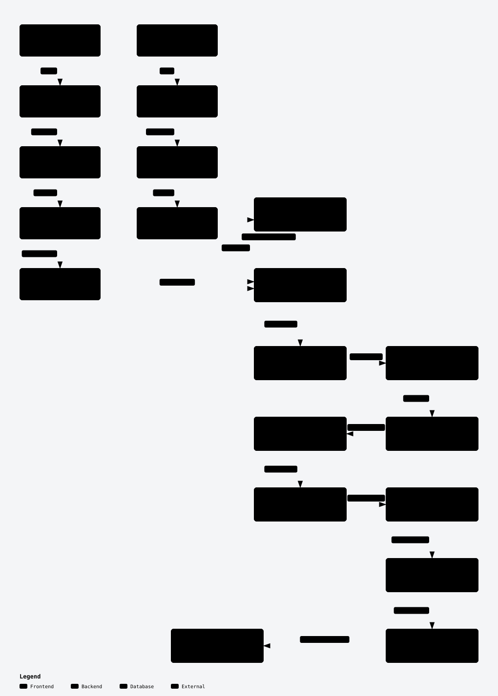

# Indexing lifecycle

DriveMind separates **metadata sync**, **content ingestion**, **chunking**, and **vector build**. Each stage is a FastAPI in-process background job; the frontend starts it and polls status before advancing.

## Drive sync and indexing

[View interactive sync and indexing flow →](https://mahad816.github.io/DriveMind_AI/interactive/indexing/)

PostgreSQL holds Drive metadata, statuses, extracted text, and searchable chunks. Qdrant holds vector-search representations keyed to PostgreSQL chunk UUIDs. Sync does not extract file contents; ingest does not create vectors. Normal chat later uses this local index.

## Stage 1: Sync Drive metadata

`POST /api/v1/index/sync` calls `DriveSyncService.sync_metadata`. The first sync, or `?full=true`, performs a full scan. Later default syncs use the saved Google Drive Changes API page token.

| Mode | Steps |
|------|-------|
| Full | Obtain a Changes API start page token **before** listing supported files; upsert their metadata and folder paths; mark previously known files missing from the scan as skipped; persist the token only when the sync succeeds. |
| Incremental | Read the saved page token; consume paginated changes; upsert new or changed supported files; mark removed, trashed, or newly unsupported files as skipped; persist the returned new token after successful processing. |

The cursor is staged after metadata processing and committed with successful sync completion. Sync stores metadata such as Drive ID, name, MIME type, folder path, and modified time. New or changed supported files become eligible for preparation; unchanged metadata avoids unnecessary reprocessing. `GET /api/v1/files` lists synced file metadata across statuses.

## Stage 2: Ingest content

`POST /api/v1/index/ingest` downloads or exports eligible Drive files, extracts and normalizes text, computes a content hash, and persists `Document` text in PostgreSQL. Supported types are Google Docs, TXT, DOCX paragraphs, text-based PDF extraction, and images with Tesseract OCR. Scanned PDFs have no OCR fallback.

The service can skip unchanged content. Successful extraction with no searchable text sets the file to `SKIPPED`; a caught content or extraction failure sets that file to `FAILED`. Healthy files in the same batch can continue through later stages even if the ingestion job reports a partial failure.

## Stage 3: Chunk text

`POST /api/v1/index/chunk` splits extracted text into deterministic overlapping chunks and stores chunk text plus PostgreSQL full-text vectors. It operates on eligible `INDEXING` files with documents. If replacement produces zero chunks, the file becomes `SKIPPED` and stale PostgreSQL chunk rows are removed. An explicit request for a previously skipped file does not revive preserved stale content.

## Stage 4: Build vector index

`POST /api/v1/index/build` embeds pending PostgreSQL chunks through OpenAI, reconciles each file's Qdrant points, and marks successfully built files `INDEXED`. Qdrant points correspond to PostgreSQL chunk UUIDs. A file with zero chunks becomes `SKIPPED`; caught embedding or vector-store errors mark the affected file `FAILED`. Other files in the batch keep their successful state.

## Jobs and file states

| File state | Meaning |
|------------|---------|
| `DISCOVERED` | Synced metadata; needs preparation |
| `INDEXING` | Content has entered the preparation pipeline |
| `INDEXED` | Build completed for its chunks; eligible for retrieval |
| `SKIPPED` | Removed/trashed/unsupported or no searchable chunks |
| `FAILED` | A preparation stage failed for this file |

`GET /api/v1/index/status` reports the latest job for the connected user. `GET /api/v1/index/pending` reports `to_ingest`, `to_chunk`, and `to_build`. A job is `COMPLETED` when its stage finishes without file-processing failures, even if no file becomes indexed. A stage with caught per-file failures is `FAILED` and carries a short error; successfully processed files retain their progress.

The frontend's `prepareKnowledge()` always starts sync, then checks pending counts. It starts ingest only when needed, refreshes pending counts, and runs chunk/build only when eligible work remains. A partial ingest failure may surface as a warning while healthy files continue. The optional `file_id` parameter on ingest, chunk, and build supports preparation of one file.

## API summary

| Endpoint | Role |
|----------|------|
| `POST /api/v1/index/sync?full=true` | Force full metadata scan |
| `POST /api/v1/index/sync` | Full first sync or incremental Changes API sync |
| `POST /api/v1/index/ingest` | Extract eligible content |
| `POST /api/v1/index/chunk` | Persist searchable chunks |
| `POST /api/v1/index/build` | Embed and reconcile Qdrant vectors |
| `GET /api/v1/index/status` | Poll latest job |
| `GET /api/v1/index/pending` | Check pending stage counts |

See [Architecture](../ARCHITECTURE.md) and [Retrieval](RETRIEVAL.md).
