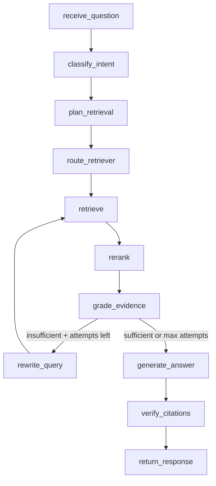

# LangGraph Workflow

How DriveMind's agent orchestrates question answering when `AGENT_GRAPH_ENABLED=true`.

---

## When LangGraph runs

LangGraph is used **only** for the `GROUNDED_RAG` route in `RagService.ask()`.

| Route | LangGraph? |
|-------|------------|
| CHITCHAT | No — direct LLM |
| FILE_INVENTORY | No — SQL inventory |
| FILE_TARGET | No — named-file lookup |
| GROUNDED_RAG | **Yes** (if flag enabled) |

Set in `.env`:

```bash
AGENT_GRAPH_ENABLED=true
AGENT_MAX_REWRITE_ATTEMPTS=2
```

Restart the backend after changing these values.

---

## Graph overview



---

## Node reference

| Node | Responsibility |
|------|----------------|
| **receive_question** | Normalize input; reset working state |
| **classify_intent** | Heuristic intent: LIST_OR_FILTER, FIND_LATEST, SUMMARIZE_TOPIC, KEYWORD_SEARCH, SEMANTIC_QUESTION, UNKNOWN |
| **plan_retrieval** | Map intent → which retrievers to activate |
| **route_retriever** | Set `active_retrievers` list |
| **retrieve** | Parallel retrieval from active sources → RRF merge |
| **rerank** | `weighted_fusion_rerank` with question-aware filename priority |
| **grade_evidence** | Threshold filter; set `evidence_sufficient` flag |
| **rewrite_query** | LLM or heuristic query rewrite; increment `rewrite_count` |
| **generate_answer** | Grounded answer with `[N]` citations |
| **verify_citations** | Strip invalid refs; renumber citations |
| **return_response** | Finalize `query_id` and `retrieval_count` |

**Module:** `backend/app/agents/drive_graph/`

---

## Intent → retriever mapping

`build_retrieval_plan()` selects retrievers per intent:

| Intent | Active retrievers | Notes |
|--------|-------------------|-------|
| FIND_LATEST | metadata, keyword | Sort by modified date desc |
| KEYWORD_SEARCH | keyword, vector | Exact term focus |
| SEMANTIC_QUESTION | vector, keyword | Conceptual search |
| SUMMARIZE_TOPIC | vector, keyword, metadata | Broad topic coverage |
| LIST_OR_FILTER | metadata only | File listing queries |
| UNKNOWN | all three | Safe default |

This is **in addition to** the top-level `query_router` — the graph handles retrieval strategy inside GROUNDED_RAG.

---

## Rewrite loop

When `grade_evidence` finds insufficient evidence:

```text
grade_evidence
    ├─ sufficient ──────────────────→ generate_answer
    ├─ insufficient + attempts left → rewrite_query → retrieve (retry)
    └─ insufficient + max reached → generate_answer (best effort)
```

`AGENT_MAX_REWRITE_ATTEMPTS` defaults to **2**.

Rewrite uses the LLM when `OPENAI_API_KEY` is set; falls back to heuristic expansion otherwise.

---

## State shape

Key fields in `DriveGraphState`:

| Field | Purpose |
|-------|---------|
| `question` | Original user question |
| `working_query` | May change after rewrite |
| `intent` | Classified query intent |
| `active_retrievers` | Subset of vector/keyword/metadata |
| `raw_chunks` | Merged candidates from retrieve |
| `ranked_chunks` | After rerank + grade |
| `evidence_sufficient` | Grade result |
| `rewrite_count` | Loop counter |
| `answer` | Generated response |
| `citations` | Verified citation list |

---

## Linear path (flag off)

When `AGENT_GRAPH_ENABLED=false`, GROUNDED_RAG uses:

```text
HybridRetriever.retrieve_with_grade()  [or VectorRetriever]
    → generate_grounded_answer()
    → filter citations
```

No intent classification, no rewrite loop, no citation verification node. Useful for debugging retrieval quality in isolation.

---

## Testing

```bash
cd backend
uv run pytest tests/agents/ -q
uv run pytest tests/retrieval/ -q
```

Agent graph tests use stub retrieve nodes when retrievers are not injected.

---

## Design rationale

| Decision | Why |
|----------|-----|
| LangGraph over linear chain | Conditional rewrite loop, selective retriever routing |
| LangChain for components | Retrievers, prompts, LLM abstraction — not flow control |
| Flag-gated agent | Compare linear vs agentic paths; simplify debugging |
| Citation verify node | Prevent hallucinated `[N]` references in answers |

---

## Related docs

- [Retrieval Strategy](RETRIEVAL.md)
- [Architecture](../ARCHITECTURE.md)
- [Evaluation](EVALUATION.md)
