# Retrieval and answer flow

DriveMind routes every question before deciding whether to retrieve document evidence. Normal answers use PostgreSQL and Qdrant, not a fresh Google Drive fetch.

## Question to answer

[View interactive answer flow →](https://mahad816.github.io/DriveMind_AI/interactive/answer-flow/)

## Top-level routes

`POST /api/v1/chat` delegates to `RagService.ask()` and `classify_query()`. The router checks these routes in order:

| Route | Behavior |
|-------|----------|
| Conversation-history recall | Uses a supplied conversation window to answer an explicit prior-message reference; no document retrieval or citations. |
| Chitchat | Narrow set of social/capability phrases; direct chat generation without document citations. Short substantive questions still reach knowledge routing. |
| File inventory | SQL-backed file counts/listings, followed by an inventory answer; no chunk citations. |
| Named-file question (`FILE_TARGET`) | Match the requested file, load its indexed PostgreSQL chunks, select bounded prompt context, and answer with citations. |
| General grounded question (`GROUNDED_RAG`) | Retrieve evidence from the local index, select bounded context, and generate a cited answer or abstain when evidence is insufficient. |

Quoted file names take precedence over pure chitchat detection. A named-file lookup can load all chunks of the matched file, but the context budget determines which chunks and how much text reach the model; the entire file is not guaranteed to fit.

## General grounded retrieval

Two independent settings shape this route:

| Setting | Default | Effect |
|---------|---------|--------|
| `AGENT_GRAPH_ENABLED` | `false` | `false`: linear `RagService` path; `true`: LangGraph retrieval, evidence grading, and bounded rewrite loop for general grounded queries only. |
| `HYBRID_RETRIEVAL_ENABLED` | `true` | On the linear path, combine Qdrant vector, PostgreSQL full-text keyword, and metadata candidates; `false` uses vector-only retrieval. |

The linear hybrid path uses reciprocal-rank fusion, weighted reranking, and evidence grading. Vector results are hydrated from indexed PostgreSQL chunks. The graph path plans which retrievers to use for its intent, can rewrite a query when evidence is weak, and has its own citation verification node. Neither setting changes the top-level conversation, chitchat, inventory, or named-file routes. See [LangGraph Workflow](LANGGRAPH.md) for its focused graph.

## Context, generation, and citations

Grounded and named-file paths call `select_prompt_chunks()` before constructing prompts. The `RAG_MAX_CONTEXT_CHARS` budget and chunk selection limit model context even when retrieval loads more candidates. OpenAI chat generation uses those selected chunks.

Citation payloads are built from selected prompt chunks, then answer references are normalized against that set. The graph path also verifies citations in its graph. Chitchat, inventory, and conversation-history recall intentionally have no document citations. The answer and citations are persisted in PostgreSQL query history. A source link calls `GET /api/v1/sources/{chunk_id}`, which returns the indexed chunk text from PostgreSQL.

This separation matters: Google Drive is accessed during sync/ingestion, while normal question answering uses the prepared local index.

## Key configuration

| Variable | Default | Purpose |
|----------|---------|---------|
| `RETRIEVAL_CANDIDATE_K` | `24` | Candidate pool per retriever |
| `RETRIEVAL_TOP_K` | `8` | Retrieval result cap before prompt selection |
| `RETRIEVAL_SCORE_THRESHOLD` | `0.35` | Vector score floor |
| `EVIDENCE_MIN_FUSION_SCORE` | `0.15` | Hybrid evidence grading threshold |
| `RAG_MAX_CONTEXT_CHARS` | `12000` | Prompt context budget |

See [Indexing](INDEXING.md) for how the local index is built, [Architecture](../ARCHITECTURE.md) for storage ownership, and [Evaluation](EVALUATION.md) for measured retrieval diagnostics.
